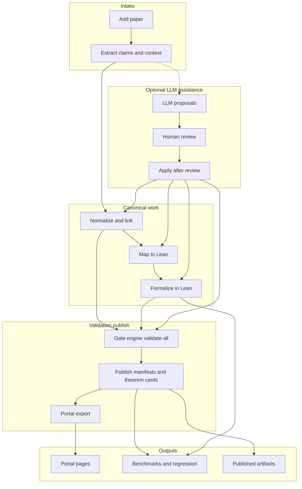

<div align="center">


# Scientific Memory

**Buildable, machine-checkable scientific knowledge.**

[](LICENSE)
[](https://lean-lang.org/)
[](https://www.python.org/)
[](https://docs.astral.sh/uv/)
[](https://pnpm.io/)

[Quick start](#quick-start) · [Documentation](#documentation) · [Repository status](#repository-status) · [Contributing](#contributing)

</div>

---

## Overview

Scientific Memory turns mathematically structured science from prose into **machine-checkable, executable, composable artifacts** with full provenance. It is not a paper summarizer or a theorem leaderboard: it is a **knowledge-upgrading pipeline** built for durable scientific inheritance.

| You get | How |
|--------|-----|
| **Traceable claims** | Every claim anchored with `source_span` and schema-valid JSON |
| **Formal layer** | Lean 4 + mathlib, linked from the corpus via mapping and theorem cards |
| **Executable witnesses** | Kernels with explicit verification boundaries |
| **Inspectable output** | Portal rendered only from canonical manifests and exports |
| **Reproducible gates** | Unified validation, CI, benchmarks, and signed releases |

---

## Mission

The project optimizes for:

| Pillar | Meaning |
|--------|---------|
| Explicit claims & assumptions | No silent hand-waving between text and formal code |
| Formal declarations | Machine-checked where the project commits to it |
| Executable kernels | Where numerical or computational alignment matters |
| Versioned provenance | Artifacts you can audit and rebuild |
| Reproducible builds | Lean, Python, and portal all part of one bar |

---

## What lives here

| Area | Role |
|------|------|
| `corpus/` | Schema-first papers: metadata, claims, assumptions, symbols, manifests |
| `formal/` | Lean 4 library (`ScientificMemory`) linked to the corpus |
| `schemas/` | Canonical JSON Schema for all public artifacts |
| `pipeline/` | `sm_pipeline`: ingest, extract, validate (**gate engine**), publish, portal export |
| `kernels/` | Executable kernels + shared [`kernels/conformance/`](kernels/conformance/) test helpers |
| `portal/` | Next.js UI from `corpus-export.json` and corpus data |
| `benchmarks/` | Regression tasks, gold labels, thresholds, proof-success trends |

---

## Quick start

```bash
git clone https://github.com/fraware/scientific-memory.git
cd scientific-memory

just bootstrap    # toolchains and dependencies
just build        # Lean + portal + Python tests
just validate     # full corpus / schema / graph gates
just portal       # local dev server (see terminal for URL)
```

| Situation | Command |
|-----------|---------|
| Something failed early | `just doctor` (uv, pnpm, Lean, Lake) |
| Lean only | `just lake-build` or `just lake-build-verbose LOG=lake-build.log` |
| Full pre-PR sweep | `just check` |
| No `just` (e.g. Windows without Bash) | [Contributor playbook – Local CI](docs/contributor-playbook.md#local-ci-checklist-green-before-merge) |

---

## Repository status

<details>
<summary><strong>Current tree (corpus, pipeline, CI, metrics)</strong> — click to expand</summary>

- **Corpus:** Six admitted papers in `corpus/index.json` (chemistry/adsorption slices, dilution reference, physics kinematics, mathematics). Scaffold `test_new_paper` was retired from the index. **Per-paper machine-checked counts and manifest `build_hash_version` / dependency-graph edge counts** are generated in [docs/status/repo-snapshot.md](docs/status/repo-snapshot.md) (`just repo-snapshot`); do not treat README prose as the live source of those numbers.
- **Pipeline:** Ingest through publish and portal export; **unified validation** in [`gate_engine`](pipeline/src/sm_pipeline/validate/gate_engine.py). **Trust boundary** (canonical JSON vs LLM/suggestion sidecars, publish integrity, build hash v2): [docs/trust-boundary-and-extraction.md](docs/trust-boundary-and-extraction.md). **Tests:** run `just test` or `uv run pytest --collect-only -q` for current counts (pipeline + kernel packages).
- **CI:** All seven gates in place (Lean build, schema + graph + migration checks, provenance, coverage, portal build + smoke test, benchmark regression with proof-success snapshot, per-paper slices, trend history, runtime budgets, minimum thresholds and **`tasks_ceiling`** upper bounds in `benchmarks/baseline_thresholds.json` (e.g. source-span alignment error rate on `tasks.gold`), release integrity). Gate 7: checksums plus **Sigstore (cosign) keyless signing**; tagged releases publish a **GitHub Release** with changelog, checksums, signatures, and `release-bundle.zip`. Verify script: `scripts/verify_release_checksums.sh`. **Quality:** Ruff on pipeline; tests as above.
- **Infra:** Policy docs in `infra/` (README, cache-policy, release-policy); CI and release under `.github/workflows/` and repo root.
- **Contributor tooling:** `just doctor` for environment diagnostics; stage banners in `just check`; `just lake-build` / `just lake-build-verbose LOG=...` for Lean build logs. SPEC and playbook use real paper ID `langmuir_1918_adsorption` in examples.
- **Metrics:** `just metrics` (median intake, dependency, symbol conflict, proof completion, axiom count, research-value including literature_errors, claims_with_clarified_assumptions, kernels_with_formally_linked_invariants, source-span alignment, normalization visibility, assumption-suggestions, dimension-visibility, dimension-suggestions). `just benchmark` writes `benchmarks/reports/latest.json` with `proof_success_snapshot`, `proof_success_summary.md`, and task outputs including **`tasks.gold`** (precision/recall/F1, `papers_with_gold`, and source-span alignment fields), **`tasks.llm_suggestions`** / **`tasks.llm_lean_suggestions`** (optional LLM sidecar footprint metrics), **`tasks.llm_eval`** (reviewed reference bundles under `benchmarks/llm_eval/`), and **`llm_prompt_templates`** (declared prompt SHA-256 map). Gate 6 compares against `benchmarks/baseline_thresholds.json` (`tasks` minima and `tasks_ceiling`). Use `just scaffold-gold <paper_id>` when admitting a paper (all indexed papers currently have gold).
- **LLM integration:** Optional Prime Intellect inference for claims, mapping, and Lean proposals (suggest-only, human-gated apply). Full end-to-end pipeline run validated on `math_sum_evens` with `allenai/olmo-3.1-32b-instruct`; evaluation infrastructure includes prompt versioning, reference fixtures, benchmark task `llm_eval`, and human review rubric. See [docs/prime-intellect-llm.md](docs/prime-intellect-llm.md) and [docs/testing/llm-lean-live-test-matrix.md](docs/testing/llm-lean-live-test-matrix.md).
- **Optional:** Blueprint check (`just check-paper-blueprint`), check-tooling (pandoc), extract-from-source, build-verso, mcp-server. Blueprints under `docs/blueprints/` cover Langmuir, Freundlich, `temkin_1941_adsorption`, and `physics_kinematics_uniform` (mapping mirror where present). **Role playbooks:** `docs/playbooks/` (formalizer, reviewer, domain-expander, release-manager). Portal dependencies pinned (Next.js ^14.2, React ^18.3) for reproducible builds. **Also:** Hypothesis-based property tests for adsorption kernels; shared kernel test helpers ([`kernels/conformance/`](kernels/conformance/) workspace package); theorem-card reviewer lifecycle ([contributor-playbook.md](docs/contributor-playbook.md#theorem-card-reviewer-lifecycle-policy)); `batch-admit --dry-run`; snapshot baseline quality validation; `validate-all --report-json` for gate reports; `just repo-snapshot` for [docs/status/repo-snapshot.md](docs/status/repo-snapshot.md).

</details>

---

## Artifact flow



---

## Documentation

| Topic | Link |
|-------|------|
| **Index** | [docs/README.md](docs/README.md) |
| **Contributor playbook** (setup, paper workflow, local CI, reuse, review, verification, Verso, schema migrations, Gate 7) | [docs/contributor-playbook.md](docs/contributor-playbook.md) |
| Architecture | [docs/architecture.md](docs/architecture.md) |
| Roadmap | [ROADMAP.md](ROADMAP.md) |
| Paper intake (SPEC 8.1) | [docs/paper-intake.md](docs/paper-intake.md) |
| Metrics (SPEC 12) | [docs/metrics.md](docs/metrics.md) |
| ADRs | [docs/adr/README.md](docs/adr/README.md) |
| Infra / CI policy | [infra/README.md](infra/README.md) |
| Repo snapshot | [docs/status/repo-snapshot.md](docs/status/repo-snapshot.md) (`just repo-snapshot`) |
| Maintainers (public push, CI, triage, launch) | [docs/maintainers.md](docs/maintainers.md) |
| MCP tooling (optional) | [docs/mcp-lean-tooling.md](docs/mcp-lean-tooling.md) |
| Prime Intellect LLM (optional, suggest-only) | [docs/prime-intellect-llm.md](docs/prime-intellect-llm.md) |
| Trust boundary and manual E2E scenarios | [docs/trust-boundary-and-extraction.md](docs/trust-boundary-and-extraction.md) · [docs/testing/trust-hardening-e2e-scenarios.md](docs/testing/trust-hardening-e2e-scenarios.md) · [LLM Lean live test matrix](docs/testing/llm-lean-live-test-matrix.md) |
| Pandoc / LaTeX (optional) | [docs/pandoc-latex-integration.md](docs/pandoc-latex-integration.md) |

---

## Contributing

| Resource | Link |
|----------|------|
| How to contribute | [CONTRIBUTING.md](CONTRIBUTING.md) |
| Step-by-step playbook | [docs/contributor-playbook.md](docs/contributor-playbook.md) |
| Pipeline extension points | [docs/pipeline-extension-points.md](docs/pipeline-extension-points.md) |

---

## Design principles

1. **Artifact-first, model-second** — durable JSON and Lean, not one-off prose.
2. **Provenance is mandatory** — claims and cards stay tied to sources.
3. **Verification boundaries are explicit** — proof vs witness vs heuristic is visible.
4. **Claim bundles are the core unit** — not isolated theorems in a void.
5. **Full buildability is the minimum bar** — no merge without the agreed gates.

---

## License

Licensed under **Apache-2.0** — see [LICENSE](LICENSE).
