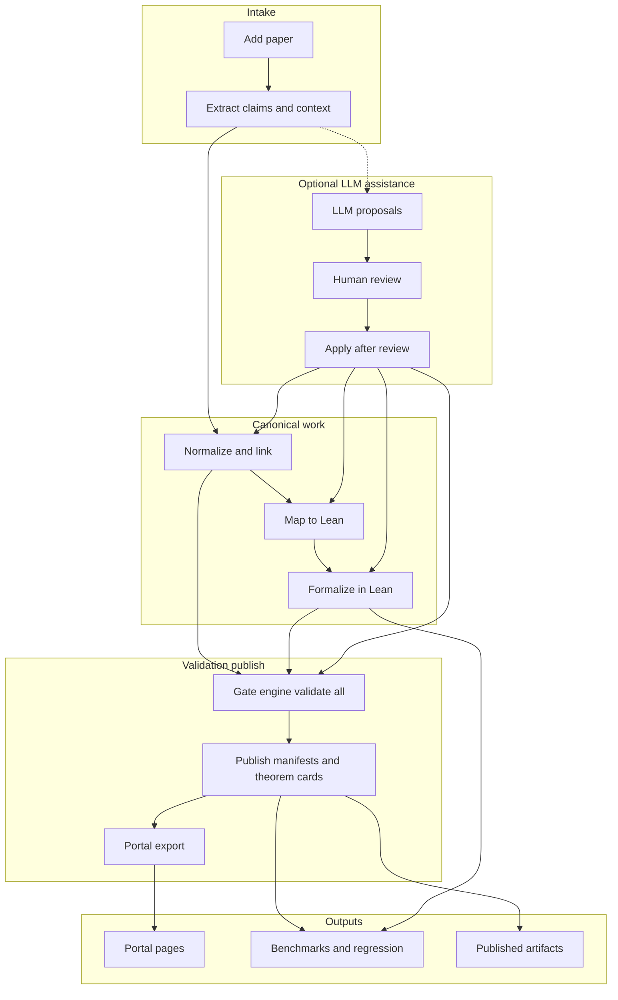

<div align="center">


# Scientific Memory

**Buildable, machine-checkable scientific knowledge.**

[](LICENSE)
[](https://lean-lang.org/)
[](https://www.python.org/)
[](https://docs.astral.sh/uv/)
[](https://pnpm.io/)

[Quick start](#quick-start) · [Documentation](#documentation) · [Repository status](#repository-status) · [Contributing](#contributing)

</div>

---

## Overview

Scientific Memory turns mathematically structured science into **machine-checkable, executable, composable artifacts** with full provenance, organized as a **knowledge-upgrading pipeline** that supports durable scientific inheritance through traceable claims, formal layers, and executable witnesses.

| You get | How |
|--------|-----|
| **Traceable claims** | Every claim anchored with `source_span` and schema-valid JSON |
| **Formal layer** | Lean 4 + mathlib, linked from the corpus via mapping and theorem cards |
| **Executable witnesses** | Kernels with explicit verification boundaries |
| **Inspectable output** | Portal renders exclusively from canonical manifests and exports |
| **Reproducible gates** | Unified validation, CI, benchmarks, and signed releases |

---

## Mission

The project optimizes for:

| Pillar | Meaning |
|--------|---------|
| Explicit claims & assumptions | Every link between source text and formal code stays explicit in the corpus |
| Formal declarations | Machine-checked where the project commits to it |
| Executable kernels | Where numerical or computational alignment matters |
| Versioned provenance | Artifacts you can audit and rebuild |
| Reproducible builds | Lean, Python, and portal all part of one bar |

---

## What lives here

| Area | Role |
|------|------|
| `corpus/` | Schema-first papers with metadata, claims, assumptions, symbols, and manifests |
| `formal/` | Lean 4 library (`ScientificMemory`) linked to the corpus |
| `schemas/` | Canonical JSON Schema for all public artifacts |
| `pipeline/` | `sm_pipeline` ingest, extract, validate (**gate engine**), publish, and portal export |
| `kernels/` | Executable kernels + shared [`kernels/conformance/`](kernels/conformance/) test helpers |
| `portal/` | Next.js UI from `corpus-export.json` and corpus data |
| `benchmarks/` | Regression tasks, gold labels, thresholds, proof-success trends |
| PCS integration | Import proof-carrying releases, portal evidence UI, pcs-bench producer ([docs/pcs/](docs/pcs/README.md)) |

---

## Quick start

```bash
git clone https://github.com/fraware/scientific-memory.git
cd scientific-memory

just bootstrap    # toolchains and dependencies
just build        # Lean + portal + Python tests
just validate     # full corpus / schema / graph gates
just portal       # local dev server (see terminal for URL)
```

| Situation | Command |
|-----------|---------|
| Something failed early | `just doctor` (uv, pnpm, Lean, Lake) |
| Lean only | `just lake-build` or `just lake-build-verbose LOG=lake-build.log` |
| Full pre-PR sweep | `just check` |
| Without `just` (or Git Bash missing) | [Contributor playbook – Local CI](docs/contributor-playbook.md#local-ci-checklist-green-before-merge) |

### Canonical Local Workflow

Use this as the single local path before opening a PR:

1. `just bootstrap`
2. `just check`
3. `just benchmark`

If you cannot use `just`, run the equivalent `uv`/`lake`/`pnpm` commands from [Contributor playbook – Local CI](docs/contributor-playbook.md#local-ci-checklist-green-before-merge). On Windows, `just` uses Git for Windows Bash (see that section). That playbook section is also the canonical non-`just` path.

---

## Repository status

<details>
<summary><strong>Current tree (corpus, pipeline, CI, metrics)</strong> — click to expand</summary>

- **Corpus** — Eight indexed papers in `corpus/index.json` (six formalized slices plus two hard-dimension stress scaffolds). Live counts and manifest hashes live in [docs/status/repo-snapshot.md](docs/status/repo-snapshot.md) (`just repo-snapshot`).
- **Pipeline** — Ingest, validate, publish, and portal export via [`gate_engine`](pipeline/src/sm_pipeline/validate/gate_engine.py). Trust boundary details appear in [docs/reference/trust-boundary-and-extraction.md](docs/reference/trust-boundary-and-extraction.md).
- **PCS** — Proof-carrying release import, portal claim pages, and pcs-bench producer ([docs/pcs/README.md](docs/pcs/README.md)).
- **CI and releases** — [docs/infra/README.md](docs/infra/README.md) and [docs/maintainers.md](docs/maintainers.md); verify tagged releases with `scripts/verify_release_checksums.sh`.
- **Metrics and benchmarks** — `just metrics` and `just benchmark` ([docs/metrics.md](docs/metrics.md), [benchmarks/README.md](benchmarks/README.md)).
- **Optional tooling** — LLM proposals (suggest-only), MCP, Pandoc/LaTeX, Verso ([docs/tooling/README.md](docs/tooling/README.md)); role playbooks ([docs/playbooks/README.md](docs/playbooks/README.md)).

</details>

---

## Artifact flow


```mermaid
flowchart TD
  subgraph intake [Intake]
    Add[Add paper]
    Extract[Extract claims and context]
  end

  subgraph optional [Optional LLM assistance]
    LLM[LLM proposals]
    Review[Human review]
    Apply[Apply after review]
  end

  subgraph canonical [Canonical work]
    Norm[Normalize and link]
    Map[Map to Lean]
    Formal[Formalize in Lean]
  end

  subgraph validation [Validation publish]
    Gates[Gate engine validate all]
    Publish[Publish manifests and theorem cards]
    Export[Portal export]
  end

  subgraph outputs [Outputs]
    Portal[Portal pages]
    Bench[Benchmarks and regression]
    Manifests[Published artifacts]
  end

  Add --> Extract
  Extract --> Norm
  Norm --> Map
  Map --> Formal
  Norm --> Gates
  Formal --> Gates
  Gates --> Publish
  Publish --> Manifests
  Publish --> Export
  Export --> Portal
  Publish --> Bench
  Formal --> Bench

  Extract -.-> LLM
  LLM --> Review
  Review --> Apply
  Apply --> Norm
  Apply --> Map
  Apply --> Formal
  Apply --> Gates
```

---

## Documentation

| Topic | Link |
|-------|------|
| **Index** | [docs/README.md](docs/README.md) |
| **Proof-Carrying Science (PCS)** | [docs/pcs/README.md](docs/pcs/README.md) |
| **Role playbooks** (formalizer, reviewer, domain expander, release manager) | [docs/playbooks/README.md](docs/playbooks/README.md) |
| **Contributor playbook** (setup, paper workflow, local CI, reuse, review, releases) | [docs/contributor-playbook.md](docs/contributor-playbook.md) |
| Architecture | [docs/architecture.md](docs/architecture.md) |
| Roadmap | [ROADMAP.md](ROADMAP.md) |
| Paper intake (SPEC 8.1) | [docs/paper-intake.md](docs/paper-intake.md) |
| Metrics (SPEC 12) | [docs/metrics.md](docs/metrics.md) |
| ADRs | [docs/adr/README.md](docs/adr/README.md) |
| Infra / CI policy | [docs/infra/README.md](docs/infra/README.md) |
| Repo snapshot | [docs/status/repo-snapshot.md](docs/status/repo-snapshot.md) (`just repo-snapshot`) |
| Maintainers (public push, CI, triage, launch) | [docs/maintainers.md](docs/maintainers.md) |
| MCP tooling (optional) | [docs/tooling/mcp-lean-tooling.md](docs/tooling/mcp-lean-tooling.md) |
| Prime Intellect LLM (optional, suggest-only) | [docs/tooling/prime-intellect-llm.md](docs/tooling/prime-intellect-llm.md) |
| Trust boundary and manual E2E scenarios | [docs/reference/trust-boundary-and-extraction.md](docs/reference/trust-boundary-and-extraction.md) · [docs/testing/trust-hardening-e2e-scenarios.md](docs/testing/trust-hardening-e2e-scenarios.md) · [LLM Lean live test matrix](docs/testing/llm-lean-live-test-matrix.md) |
| Pandoc / LaTeX (optional) | [docs/tooling/pandoc-latex-integration.md](docs/tooling/pandoc-latex-integration.md) |

---

## Contributing

| Resource | Link |
|----------|------|
| How to contribute | [CONTRIBUTING.md](CONTRIBUTING.md) |
| Step-by-step playbook | [docs/contributor-playbook.md](docs/contributor-playbook.md) |
| Pipeline extension points | [docs/pipeline-extension-points.md](docs/pipeline-extension-points.md) |

---

## Design principles

1. **Artifact-first, model-second** — durable JSON and Lean artifacts anchor every contribution.
2. **Provenance is mandatory** — claims and cards stay tied to sources.
3. **Verification boundaries are explicit** — proof, witness, and heuristic roles remain visible in manifests and portal views.
4. **Claim bundles are the core unit** — each formal result ships with claims, assumptions, and linked context.
5. **Full buildability is the minimum bar** — merges require the agreed validation and benchmark gates to pass.

---

## License

Licensed under **Apache-2.0** — see [LICENSE](LICENSE).
