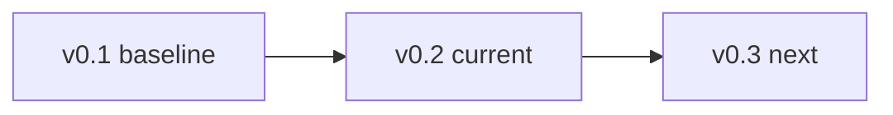

# Roadmap

**Where Scientific Memory has been, where it is, and what comes next.**

[SPEC](docs/SPEC.md) · [README](README.md) · [Contributor playbook](docs/contributor-playbook.md)

---

## Release phases

| Version | Status | Summary |
|---------|--------|---------|
| **v0.1** | Shipped | Monorepo, schemas, first end-to-end paper, Lean theorem cards, portal, CI |
| **v0.2** | **Current** | Multi-paper corpus, kernels, benchmarks, gold gates, release signing, reviewer workflows, **optional LLM assistance (suggest-only, human-gated)** |
| **v0.3** | Planned | Proof-repair apply, corpus growth tooling, continued multi-domain depth |

---

## v0.1

| Deliverable | Notes |
|-------------|--------|
| Monorepo scaffold | Lean + Python (`uv`) + portal (`pnpm`) |
| Canonical schemas | JSON Schema as source of truth |
| First admitted paper | Proof of full intake path |
| First end-to-end paper artifact | Claims through portal |
| First Lean theorem cards | Linked to corpus |
| First portal pages | Manifest-driven |
| CI | Build, validation, coverage gates |

---

## v0.2

### Corpus and formal

| Item | Detail |
|------|--------|
| Multi-paper slice | Langmuir, Freundlich, `chem_dilution_reference`, `temkin_1941_adsorption`; `math_sum_evens`; `physics_kinematics_uniform` (15 machine-checked claims, full assumptions/symbols, Hypothesis kernel tests) |
| Kernels | Adsorption papers in `corpus/kernels.json`; Langmuir and Freundlich linked in portal |
| Dependency graph | From Lean extraction: `theorem_cards[].dependency_ids`, `manifest.dependency_graph`; portal smoke asserts non-empty graph for Langmuir |
| Extraction runs | Papers with claims must have `extraction_run.json` (validation fails otherwise) |

### Portal and diff

| Item | Detail |
|------|--------|
| Assumption drift | Diff page |
| Kernel pages | Executable linkage for Langmuir and Freundlich |
| Dependencies | Next ^14.2, React ^18.3 (pinned) |

### Benchmarks, gold, and Gate 6

| Item | Detail |
|------|--------|
| Dashboards | Portal coverage dashboard; benchmark in CI |
| Proof success | Snapshot, per-paper slices, `benchmarks/reports/trend/proof_success_history.json`, `proof_success_summary.md` (warn if proof fraction drops) |
| Budgets | Runtime budgets; workflow uploads report artifacts |
| Gold task | Precision/recall/F1 for claims (and assumptions when present); `papers_with_gold`, `gold_claim_count`; `tasks.gold` source-span fields (`source_span_total_compared`, `source_span_alignment_error_count`, `source_span_alignment_error_rate`) |
| Thresholds | `benchmarks/baseline_thresholds.json`: `tasks` minima and `tasks_ceiling` (e.g. `source_span_alignment_error_rate` max **0**) |
| Gold data | All six indexed papers under `benchmarks/gold/` |

### Metrics and normalization

| Item | Detail |
|------|--------|
| `just metrics` | Median intake, dependency, symbol conflict, proof completion, axiom count, research-value (`literature_errors`, `claims_with_clarified_assumptions`, `kernels_with_formally_linked_invariants`, source-span alignment, normalization visibility, assumption/dimension suggestions) |
| Normalization policy | Optional `benchmarks/normalization_policy.json`; `just metrics --normalization-policy` (warn-only unless CI extended) |

### Contributors and review

| Item | Detail |
|------|--------|
| Docs and templates | Playbook, reviewer guide, PR template; examples use `langmuir_1918_adsorption` |
| Claim status | Invalid statuses rejected; disputed claims require `review_notes` |
| Theorem cards | Reviewer lifecycle with staged enforcement ([contributor-playbook](docs/contributor-playbook.md#theorem-card-reviewer-lifecycle-policy)); metrics warn on `machine_checked_but_unreviewed` |
| Proof repair | Proposals CLI (human-review boundary); role playbooks in `docs/playbooks/` |
| Blueprints | Blueprint–mapping contract; Langmuir and Freundlich blueprints mirror mapping; optional `just check-paper-blueprint` |

### Infra and release

| Item | Detail |
|------|--------|
| Policy docs | `infra/README.md`, `infra/cache-policy.md`, `infra/release-policy.md` |
| Gate 7 | Sigstore (cosign) keyless signing of `dist/checksums.txt`; GitHub Release with bundle zip |

### Optional LLM assistance (suggest-only, human-gated)

| Item | Detail |
|------|--------|
| Prime Intellect integration | Optional inference for claims, mapping, and Lean proposals; suggest-only architecture with human-gated apply |
| Evaluation infrastructure | Prompt template versioning (`prompt_template_id`, `prompt_template_sha256`), reference fixtures under `benchmarks/llm_eval/`, benchmark task `llm_eval`, human review rubric |
| Live testing | Full end-to-end pipeline run validated on `math_sum_evens` with `allenai/olmo-3.1-32b-instruct`; all three LLM surfaces (claims, mapping, Lean) operational |
| Commands | `just llm-claim-proposals <paper_id>`, `just llm-mapping-proposals <paper_id>`, `just llm-lean-proposals <paper_id>`; `just llm-live-eval` for smoke reports |
| Documentation | [docs/prime-intellect-llm.md](docs/prime-intellect-llm.md), [docs/testing/llm-lean-live-test-matrix.md](docs/testing/llm-lean-live-test-matrix.md), [docs/testing/llm-human-eval-rubric.md](docs/testing/llm-human-eval-rubric.md), [ADR 0011](docs/adr/0011-llm-worker-suggest-only.md), [ADR 0013](docs/adr/0013-llm-evaluation-policy.md) |

### Optional tooling

| Command | Purpose |
|---------|---------|
| `just check-tooling` | Pandoc availability |
| `just extract-from-source <paper_id>` | LaTeX / source-assisted extraction |
| `just build-verso` | Long-form docs when Verso is wired |
| `just mcp-server` | MCP tools (`uv sync --extra mcp`) |

### Milestone 3 snapshot (manifests)

| Paper | Machine-checked declarations |
|-------|------------------------------|
| Langmuir | 20 |
| Freundlich | 12 |
| Temkin | 12 |
| `math_sum_evens` | 1 |
| `chem_dilution_reference` | 2 |
| `physics_kinematics_uniform` | 15 |
| **Total** | **62** |

Portal and `just metrics --proof-completion` reflect these totals.

---

## Final sprint checklist

> **Target:** [`chem_dilution_reference`](corpus/papers/chem_dilution_reference/) — chemistry dilution slice.

| Step | Status |
|------|--------|
| Claims with valid `source_span` and `linked_assumptions` / `linked_symbols` | Done |
| `mapping.json` maps every machine-checked claim to Lean in `formal/ScientificMemory/Chemistry/Solutions/DilutionRef.lean` | Done |
| `theorem_cards.json` and `manifest.json` via `just publish-artifacts chem_dilution_reference` (no hand-edited coverage) | Done |
| Gold under `benchmarks/gold/chem_dilution_reference/` (claims, `source_spans.json`, assumptions) | Done |
| `benchmarks/baseline_thresholds.json` aligned with post-sprint totals | Done |
| Full local CI parity: [Contributor playbook – Local CI](docs/contributor-playbook.md#local-ci-checklist-green-before-merge) (validate-all, pytest, adsorption tests, portal lint/build, smoke-graph, benchmark; Lean `lake build`) | Done |

---

## v0.3 (next)

| Theme | Deliverable |
|-------|-------------|
| Proof repair | Human-gated **`proof-repair-apply`** on `formal/` (no CI auto-apply); deeper automation optional |
| Corpus depth | `physics_kinematics_uniform` at 15 claims with full intake; probability / larger physics still open |
| Corpus growth | **`batch-admit`** with `--dry-run` (CLI-only policy); contributor dry-run workflow; release corpus delta script |

---

## Content target (Milestone 3)

| Goal | State |
|------|--------|
| Original target | 20–40 meaningful machine-checked claims across one or more papers |
| Current | **Exceeds** upper bound: **62** declarations across **six** papers |
| Next stretch | More real-source papers or richer domains |
| Track progress | `just metrics` (proof completion / Milestone 3 line) and portal dashboard |

### Content sprint checklist (historical 20–40 target)

1. Extend `corpus/papers/<paper_id>/claims.json` (`source_span`, `linked_assumptions`, `linked_symbols` as needed).
2. Update `mapping.json` (`claim_to_decl`) and Lean under `formal/`.
3. `just publish-artifacts <paper_id>`; `just validate` and `just build` green.
4. Set `machine_checked` where proofs are complete; watch dashboard and `just metrics --proof-completion`.
5. Workflow: [Contributor playbook](docs/contributor-playbook.md), [CONTRIBUTING.md](CONTRIBUTING.md).

---

## Domain expansion

**Criteria for a new `domain` value**

| Rule | Detail |
|------|--------|
| Metadata | `domain` on paper and in `corpus/index.json` |
| Allowed values | `chemistry`, `mathematics`, `physics`, `probability`, `control`, `quantum_information`, `other` (per schema) |
| Policy | Document domain-specific rules in [Contributor playbook – Domain policy](docs/contributor-playbook.md#domain-policy) when needed |
| Routing | No new pipeline or portal routes required per domain |

**Candidate directions (SPEC 15)**

| Area | Examples |
|------|----------|
| Physics theory | PhysLean / physlib, 2HDM / Lean-QuantumInfo |
| Probability | Foundations |
| Adjacent science | Dense math-meets-physical science near the adsorption wedge |

**Steps to admit a paper in a new domain**

| # | Action |
|---|--------|
| 1 | `just add-paper <paper_id>`; set `domain` in `metadata.json` |
| 2 | Add the paper to `corpus/index.json` with matching `domain` |
| 3 | `just extract-claims`, `just scaffold-formal`; edit claims, assumptions, mapping |
| 4 | `just check-paper <paper_id>`, `just publish-artifacts <paper_id>`; `just validate` and `just build` |
| 5 | Optional: blueprint under `docs/blueprints/` |

---

## See also

| Doc | Use when |
|-----|----------|
| [Contributor playbook – Domain policy](docs/contributor-playbook.md#domain-policy) | Domain-specific conventions |
| [Contributor playbook – Theorem-card lifecycle](docs/contributor-playbook.md#theorem-card-reviewer-lifecycle-policy) | Theorem-card review phases |
| [docs/paper-intake.md](docs/paper-intake.md) | Admitting papers (SPEC 8.1) |
